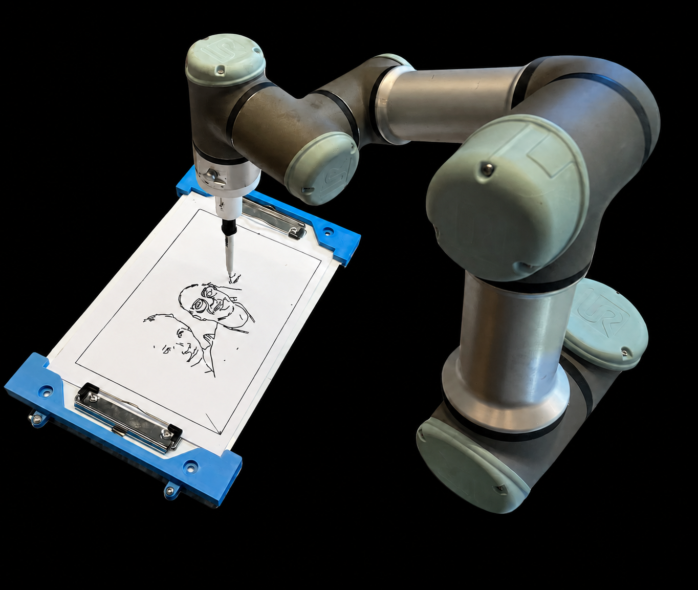

# IllustrateUR3

A ROS2-based selfie drawing robot — a UR3 arm draws your portrait on paper using computer vision and MoveIt2 motion planning. The operator controls the system hands-free via gestures while standing in front of the camera.



**✏️ Draws portraits on paper** — fully autonomous, pen on physical paper via a UR3 robotic arm

**👁️ Computer vision pipeline** — MediaPipe background removal, Canny edge detection, and intelligent stroke ordering to minimise pen travel

**🎭 Artistic overlays** — apply glasses, hat, moustache, or novelty masks to the portrait before drawing

**🖊️ Multi-colour support** — automatic pen attach/detach from a storage rack for colour changing between portraits

**🤙 Fully gesture-controlled** — thumbs up to capture, Green Giant to draw, no keyboard needed while in front of the camera

**✍️ Personalised signature** — SVG signature appended to every finished portrait

---

## Quick Start

```bash
# Clone and build
git clone https://github.com/Greese-d/illustrateUR3.git ~/ros2_ws/src/illustrateUR3
cd ~/ros2_ws
rosdep install --from-paths src --ignore-src -r -y
source /opt/ros/humble/setup.bash
colcon build --symlink-install
source install/setup.bash

# Install Python dependencies
pip install opencv-python scipy Pillow
python3 -m pip install --user "numpy==1.26.4" "mediapipe==0.10.14"

# Launch (simulated)
ros2 launch illustrateur3_gui main.launch.py launch_camera:=true

# Launch (real robot)
ros2 launch illustrateur3_gui main.launch.py launch_camera:=true use_fake_hardware:=false
```

---

## Documentation

Full documentation is available in the **[Wiki](https://github.com/Greese-d/illustrateUR3/wiki)**.
